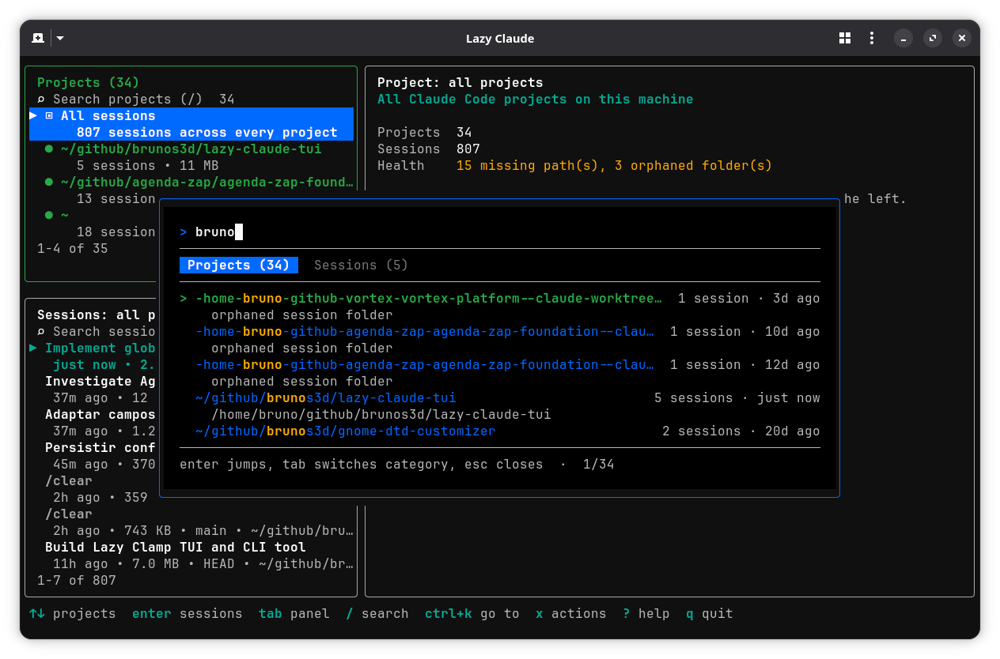
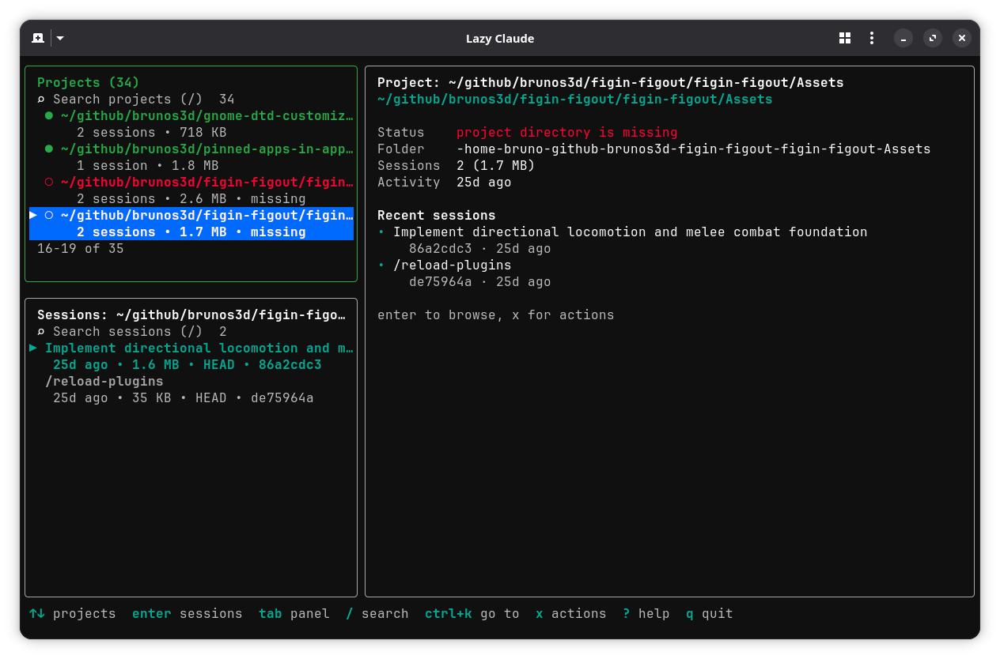
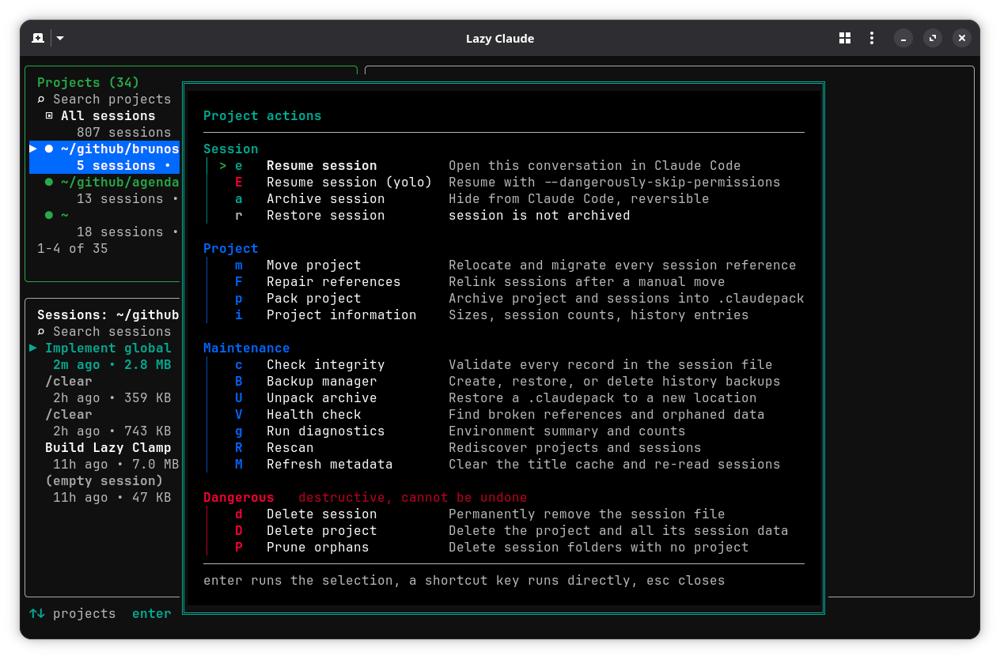
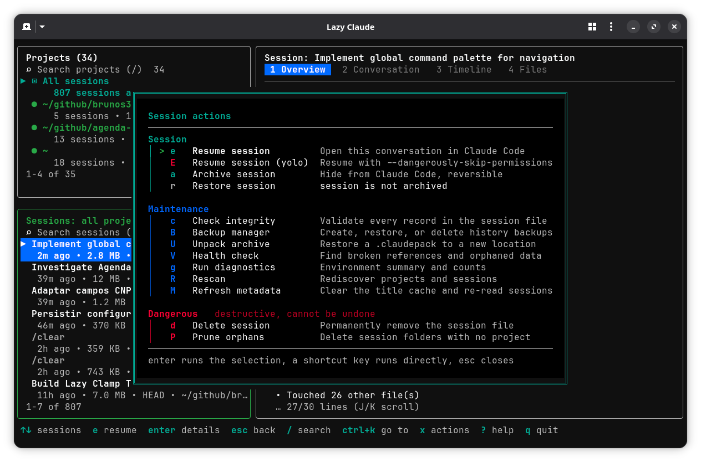

# Lazy Claude

A terminal UI for finding, resuming and maintaining Claude Code sessions.

[](https://www.npmjs.com/package/lazy-claude-tui)
[](https://nodejs.org)
[](LICENSE)

Claude Code stores every conversation as a UUID-named file, and its own picker only lists the directory you happen to be standing in. After a few weeks that is hundreds of sessions spread across dozens of projects, with no way to search them and no way to move a project without orphaning its history.

Lazy Claude reads the same files Claude Code writes. Every session shows its real title, `ctrl+k` searches all of them at once, and one key hands the terminal over to `claude --resume` in the right directory. It also fixes the things Claude Code has no answer for: moving a project without losing its sessions, repairing references after a manual `mv`, archiving what you no longer need, and backing up the history index before every change.



## Contents

- [Why it exists](#why-it-exists)
- [Features](#features)
- [Installation](#installation)
- [Quick start](#quick-start)
- [Interface overview](#interface-overview)
- [Command palette](#command-palette)
- [Session inspector](#session-inspector)
- [Actions](#actions)
- [Managing projects and sessions](#managing-projects-and-sessions)
- [Keyboard shortcuts](#keyboard-shortcuts)
- [CLI](#cli)
- [Configuration](#configuration)
- [Demo](#demo)
- [Supported platforms](#supported-platforms)
- [Documentation](#documentation)
- [Contributing](#contributing)

## Why it exists

Two problems, both caused by how Claude Code stores sessions on disk.

Finding an old conversation is hard. Sessions are named by UUID, the resume picker is scoped to the current directory, and there is no search across projects. If you remember the work but not where you did it, you are out of luck.

Moving a project breaks its history. Claude Code derives each storage path from the project's absolute path, so a plain `mv` orphans every session that belonged to it. Renaming a repository does the same thing.

Lazy Claude solves both without touching Claude Code itself. It reads the same metadata, understands the same encoding, and hands control back to `claude` when you want to continue a conversation.

## Features

- Sessions listed by their real title, with branch, size and age beside them
- Global command palette (`ctrl+k`) that searches every project and session at once
- Fuzzy search (`/`) inside each panel, fzf-style, with matched characters highlighted
- Session inspector with four tabs: overview statistics, conversation preview, activity timeline and file list
- Resume in Claude Code from anywhere, with or without permission prompts
- Move a project and migrate every session reference, including nested sub-projects and worktrees
- Repair references after a manual `mv` or rename
- Archive, restore and delete individual sessions
- Pack a project and its sessions into a portable `.claudepack` archive
- Timestamped `history.jsonl` backups before every mutation, with a manager to restore them
- Health check, diagnostics and pruning for orphaned session folders
- Integrity check that validates every record in a session file
- Dry-run mode on every destructive operation
- Overlay dialogs that stack on top of the interface instead of replacing it
- A CLI that exposes every operation for scripts
- Native TypeScript, no shell-outs, three runtime dependencies

## Installation

The package is published as `lazy-claude-tui`. It installs four commands, all running the same binary: `lazyclaude` (the main one), plus `lazy-claude`, `lazy-claude-tui` and `lzc`.

Requires Node.js 18 or newer.

Global install:

```bash
npm install -g lazy-claude-tui
```

```bash
pnpm add -g lazy-claude-tui
```

```bash
yarn global add lazy-claude-tui
```

```bash
bun add -g lazy-claude-tui
```

Run it once without installing:

```bash
npx lazy-claude-tui
pnpm dlx lazy-claude-tui
yarn dlx lazy-claude-tui
bunx lazy-claude-tui
```

From source:

```bash
git clone https://github.com/brunos3d/lazy-claude.git
cd lazy-claude
npm install       # builds via the prepare script
npm link          # exposes lazyclaude and its aliases globally
```

## Quick start

```bash
npm install -g lazy-claude-tui
lazyclaude
```

That is it. The TUI opens on every project it finds.

```bash
lazyclaude .              # open on the current workspace
lazyclaude ~/code/app     # open on a specific project
```

Inside the TUI:

1. Press `ctrl+k` and type a few characters to find any session.
2. Press `enter` to jump to it.
3. Press `e` to resume it in Claude Code.

Press `?` for help and `q` to quit.

## Interface overview

The screen is three panels and a footer.

| Panel        | Contents                                                                              |
| ------------ | ------------------------------------------------------------------------------------- |
| Projects     | Every project, plus an "All sessions" row that widens the session list to the machine  |
| Sessions     | Sessions belonging to the highlighted project, live or archived                        |
| Inspector    | The project summary, or the session details once Sessions or Details has focus         |



The left column is a hierarchy. Projects sit on top and their sessions below, and both stay on screen, so the workspace you are in never disappears while you browse its sessions. Sessions always belong to the highlighted project, whichever panel has focus.

Focus moves with `tab` through Projects, Sessions and Details. `enter` steps down the hierarchy, `esc` steps back up. The focused panel has a green border and paints its selection as a solid bar; the others keep a `▶` marker so the current project and session stay identifiable.

Project rows carry their status. A green dot means the directory exists, red means it is missing, and a folder with no resolvable path is listed as an orphan. Selecting one shows what is wrong in the inspector, which is where a repair usually starts.

Dialogs are overlays, not screens. Confirmations, pickers, reports and the action menu draw on top of the interface while the panels stay visible and keep their selection, so closing a dialog returns you exactly where you were. Only the top dialog receives keys. Dialogs stack, so a confirmation raised from a picker layers over it.

## Command palette

`ctrl+k` opens a global search over every project and session on the machine, live and archived. It exists because the per-panel `/` search only filters the list in front of you, which is no help when you cannot remember which project the work was in.


Type to search. Results are grouped into categories with a tab bar under the input, and each tab owns the whole result area, so nothing is truncated and long result sets stay reachable. A category with no hits has no tab, so you can never land on an empty one. Each tab keeps its own cursor and scroll position.

| Key             | Action                          |
| --------------- | ------------------------------- |
| `ctrl+k`        | open the palette                |
| `tab` / `shift+tab` | switch category             |
| `↑` / `↓`       | move through results            |
| `pgup` / `pgdn` | page through results            |
| `enter`         | jump to the selected result     |
| `ctrl+u`        | clear the query                 |
| `esc`           | close                           |

Jumping selects the result's project, loads its sessions, highlights the session and focuses the right panel. Jumping to an archived session flips the list to the archived view first. Recent searches appear when the input is empty.

The palette navigates and nothing else. Operations stay in the action menu, which keeps both predictable.

## Session inspector

Step into the Sessions panel and the inspector reads the highlighted session in a single pass, filling four tabs. Press `1` to `4` to switch between them, or `tab` while the Details panel has focus.

| Tab              | Contents                                                                             |
| ---------------- | ------------------------------------------------------------------------------------ |
| `1` Overview     | Id, project, branch, size, timestamps, message and tool-call counts, tokens, duration, model, top tools |
| `2` Conversation | A readable preview of the exchange                                                   |
| `3` Timeline     | Activity over the life of the session                                                |
| `4` Files        | Files the session touched and created                                                |

`J` and `K` scroll the inspector from any panel, so you can read a preview without leaving the session list.

Titles come from the `ai-title` record Claude Code writes, the same one its resume picker shows. When a session has no AI title, the label falls back in order to the opening prompt, the first user message, the slash command that started it, and finally `(empty session)`. Inferred titles are dimmed so a guess never looks like a real title.

## Actions

Press `x` for the action menu. It is the single place every operation lives, grouped into Session, Project, Maintenance and Dangerous, with the destructive group last and marked in red. Unavailable actions stay listed with the reason, so the menu doubles as documentation.



The menu adapts to the focused panel. From Projects it offers the project operations; from Sessions it drops them and leads with the session ones.



Inside the menu, `enter` runs the selection and typing a shortcut key runs it directly.

| Key | Action              | Group       |
| --- | ------------------- | ----------- |
| `e` | Resume session      | Session     |
| `E` | Resume session (yolo) | Session   |
| `a` | Archive session     | Session     |
| `r` | Restore session     | Session     |
| `m` | Move project        | Project     |
| `F` | Repair references   | Project     |
| `p` | Pack project        | Project     |
| `i` | Project information | Project     |
| `c` | Check integrity     | Maintenance |
| `B` | Backup manager      | Maintenance |
| `U` | Unpack archive      | Maintenance |
| `V` | Health check        | Maintenance |
| `g` | Run diagnostics     | Maintenance |
| `R` | Rescan              | Maintenance |
| `M` | Refresh metadata    | Maintenance |
| `d` | Delete session      | Dangerous   |
| `D` | Delete project      | Dangerous   |
| `P` | Prune orphans       | Dangerous   |

Destructive actions confirm first and show the exact planned steps.

## Managing projects and sessions

### Resuming

`e` resumes the highlighted session, `E` resumes it with `--dangerously-skip-permissions` after a confirmation that shows the exact command.

Neither wraps Claude Code. Lazy Claude unmounts, leaves the alternate screen, prints the shell equivalent, then executes Claude Code in the project's own directory with stdio inherited. What you get is the same as typing:

```bash
cd <project-directory>
claude --resume <session-id>
```

Everything is validated before the interface exits, so a missing `claude` binary, a project directory that has moved, a deleted session file, or an archived session (invisible to Claude Code until restored) each produce a dialog you can act on instead of a broken terminal.

### Moving a project

`lazyclaude move` operates on a project rather than a session. It moves the directory, renames the session folder for every session bound to it, migrates the folders of nested sub-projects and worktrees, updates `history.jsonl`, and keeps archived sessions in sync. Nothing has to be resumed.

```bash
lazyclaude move ~/code/old-name ~/code/new-name
lazyclaude move --here ~/code/some-project     # move it into the current directory
lazyclaude move ~/a ~/b -n                     # print the plan, change nothing
```

If the directory already moved, `lazyclaude repair` performs the same relocation after the fact. It auto-detects broken entries, searches likely new locations, and relinks explicitly or interactively.

```bash
lazyclaude repair                          # scan and relink what it can find
lazyclaude repair ~/code/new-location      # relink a known project by its new path
lazyclaude repair --from ~/old --to ~/new  # relink explicitly
```

Both run as journaled operations: every step records its inverse, and a failure undoes the completed steps in reverse order.

### How this differs from `/cd` and `/add-dir`

Claude Code has two built-ins that touch this area, and they solve a different problem.

`/cd` changes the working directory of the session you have open and, since v2.1.169, relocates that session's storage too. Its scope is exactly one session: moving N sessions means resuming each and running `/cd` N times. `/add-dir` grants the open session access to an extra directory and relocates nothing.

|                        | Scope                                   | Session must be open | Moves storage             | N sessions at once |
| ---------------------- | --------------------------------------- | -------------------- | ------------------------- | ------------------ |
| `/cd`                  | the one open session                    | Yes                  | Yes, from v2.1.169        | No                 |
| `/add-dir`             | the one open session                    | Yes                  | No                        | No                 |
| `lazyclaude move`      | a project and every session bound to it | No                   | Yes, project and folders  | Yes                |
| `lazyclaude repair`    | same, when the directory already moved  | No                   | Yes, session folders      | Yes                |
| `lazyclaude pack`      | one project, archived and restored      | No                   | Yes                       | Yes                |

Use `/cd` for a single live session you are working in right now. Use Lazy Claude when relocating a repository together with its full history, or repairing one that already moved.

### Archiving

Archiving moves a session file to `~/.claude/lazy-claude/archive/`, outside the projects directory, so Claude Code stops listing it until you restore it. Nothing is deleted. Press `t` to toggle between live and archived sessions, `a` to archive, `r` to restore.

### Packing

`lazyclaude pack` writes a project and all its sessions into a portable `.claudepack` archive. `unpack` restores it to a new location and rewrites the paths for the new machine, which makes it the closest thing to a full snapshot before a large change.

```bash
lazyclaude pack ~/code/app                 # writes ./app.claudepack
lazyclaude pack ~/code/app ~/backups/app   # or name the archive yourself
lazyclaude unpack ./app.claudepack ~/code/app-restored
```

The destination must not already exist, so an unpack never merges into a live project by accident. Pass `-f` if you mean to overwrite.

### Backups and health

`move`, `repair`, `remove` and `unpack` back up `history.jsonl` before touching anything, unless you pass `--no-backup`. The backup manager (`B`) creates, restores and deletes those snapshots.

> [!NOTE]
> The automatic backup covers `history.jsonl`, not the transcripts themselves. For a full snapshot before a large change, run `lazyclaude pack`.

`lazyclaude verify` reports missing project directories and orphaned session folders and exits non-zero when it finds either. `lazyclaude doctor` prints where everything lives and how much of it there is. `lazyclaude prune` deletes session folders whose project no longer exists.

## Keyboard shortcuts

Navigation

| Key                | Action                                        |
| ------------------ | --------------------------------------------- |
| `↑` / `k`, `↓` / `j` | move within the focused panel               |
| `tab`              | cycle Projects, Sessions, Details             |
| `shift+tab`        | cycle backwards                               |
| `enter`, `→` / `l` | step down the hierarchy                       |
| `esc`, `←` / `h`   | step back up                                  |

Search

| Key                | Action                                        |
| ------------------ | --------------------------------------------- |
| `/`                | search the focused list                       |
| `↑` / `↓`          | move through matches while typing             |
| `enter`            | keep the filter, hand the keyboard back       |
| `ctrl+u`           | clear the query without leaving search        |
| `esc`              | clear the query and leave search              |
| `ctrl+k`           | command palette, searches everything          |

Inspector

| Key         | Action                                               |
| ----------- | ---------------------------------------------------- |
| `1` .. `4`  | overview, conversation, timeline, files              |
| `tab`       | next tab, while the Details panel has focus          |
| `J` / `K`   | scroll the inspector from any panel                  |

Actions

| Key | Action                                              |
| --- | --------------------------------------------------- |
| `x` | open the action menu                                |
| `e` | resume the session in Claude Code                   |
| `E` | resume with `--dangerously-skip-permissions`        |
| `a` | archive the session                                 |
| `r` | restore an archived session                         |
| `d` | delete the session permanently                      |
| `c` | check session file integrity                        |

Every other operation is reached through the action menu. Its shortcut keys are listed in [Actions](#actions) and work while the menu is open.

General

| Key | Action                                |
| --- | ------------------------------------- |
| `t` | toggle live and archived sessions     |
| `R` | rescan projects and sessions          |
| `?` | help                                  |
| `q` | quit                                  |

## CLI

Every TUI operation is also a command. Both front ends call the same services, so behavior is identical.

```bash
lazyclaude list [--json]            # all projects with status
lazyclaude sessions [archived]      # all sessions, titled
lazyclaude show <session-id>        # stats, preview and timeline
lazyclaude search <query>           # match titles, ids, paths, branches
lazyclaude info [path] [--json]     # project details (defaults to cwd)
lazyclaude doctor                   # environment summary
lazyclaude verify                   # health check (exit 1 when issues found)

lazyclaude move <src> <dest>        # move project + migrate references
lazyclaude move --here <src>        # move project into the current dir
lazyclaude repair                   # scan and relink broken references
lazyclaude repair <new-path>        # relink a moved project by new path
lazyclaude repair --from A --to B   # relink explicitly
lazyclaude prune                    # remove orphaned session folders
lazyclaude remove <path>            # delete project + all session data

lazyclaude pack <path> [archive]    # create .claudepack
lazyclaude unpack <archive> <dest>  # restore .claudepack

lazyclaude backup                   # list history backups
lazyclaude backup create
lazyclaude backup restore <name>
lazyclaude backup delete <name>

lazyclaude session archive <id>     # ids accept unique prefixes
lazyclaude session restore <id>
lazyclaude session delete <id>
lazyclaude session check <id>       # integrity scan
```

| Flag              | Meaning                                      |
| ----------------- | -------------------------------------------- |
| `-n`, `--dry-run` | print the plan, change nothing               |
| `-f`, `--force`   | skip confirmation prompts                    |
| `-p`, `--parents` | create missing parent directories            |
| `--no-backup`     | skip the automatic `history.jsonl` backup    |
| `--json`          | JSON output for `list`, `sessions` and `info` |

Session ids accept unique prefixes, so `lazyclaude show 155552ca` is enough.

The TUI needs a TTY and exits with an error otherwise. Use the CLI to inspect things from a script or a pipe.

## Configuration

| Variable                  | Purpose                                                              |
| ------------------------- | -------------------------------------------------------------------- |
| `LAZY_CLAUDE_CLAUDE_DIR`  | Override the Claude data directory. Useful for testing against a copy |
| `CLAUDE_CONFIG_DIR`       | Respected when set, the same variable Claude Code uses                |
| `LAZY_CLAUDE_CLAUDE_BIN`  | Path to the `claude` executable, when it is not on `PATH`             |

The data directory resolves in that order and falls back to `~/.claude`.

> [!WARNING]
> Lazy Claude reads and mutates real Claude Code data. Point `LAZY_CLAUDE_CLAUDE_DIR` at a throwaway directory before trying anything destructive.

## Demo

A walkthrough of finding a session, inspecting it, and resuming it:

https://github.com/user-attachments/assets/1a9a7ca4-f129-4eeb-96b2-6297c67345ed

## Supported platforms

| Platform | Status                                                             |
| -------- | ------------------------------------------------------------------ |
| Linux    | primary target, developed and tested here                          |
| macOS    | expected to work, including case-insensitive path canonicalization |
| Windows  | designed for, not yet tested                                       |

All filesystem work uses Node.js APIs, path handling is separator-aware, the encoding treats `\` and `:` the way Claude Code does on Windows, and cross-device moves fall back to copy-and-delete. The only runtime dependencies are `ink`, `react` and `tar`.

## Documentation

- [Architecture](docs/architecture.md), for anyone changing the code
- [Command palette design](docs/superpowers/specs/2026-08-03-command-palette-design.md)
- [Claude Code sessions documentation](https://code.claude.com/docs/en/sessions), the upstream format this relies on

One caveat worth stating plainly: this depends on an on-disk layout that is internal to Claude Code and changes between versions.

## Contributing

```bash
git clone https://github.com/brunos3d/lazy-claude.git
cd lazy-claude
npm install
npm run dev       # tsc --watch
npm test          # tsc, then node --test over the compiled output
npm link          # try your build as lazyclaude
```

Running the tests needs Node 21 or newer, while the published CLI supports Node 18. There is no linter or formatter; `tsc` under `strict` is the type check.

Read [docs/architecture.md](docs/architecture.md) first. It explains the layer separation, the journaled mutations, and why the on-disk encoding is never decoded. Issues and pull requests are welcome.

## Credits

Inspired by [LazyGit](https://github.com/jesseduffield/lazygit) for the interface model, and by [Clamp](https://github.com/wsagency/claude-move-project), whose behavior served as the reference for the session-migration semantics.

## License

MIT
